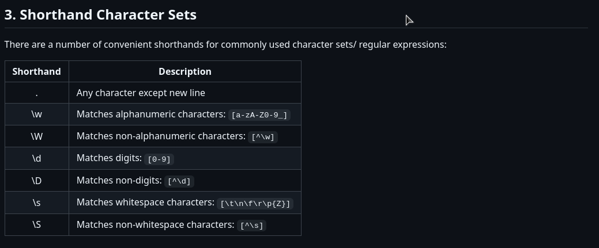
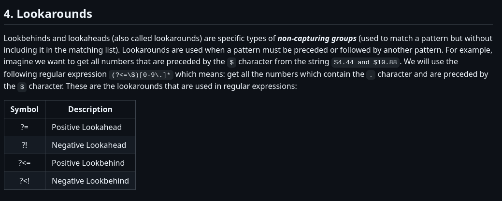
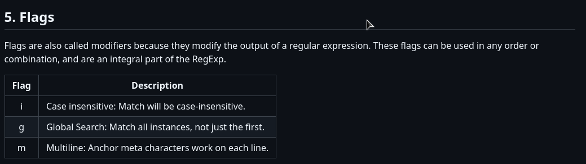

# regex-with-py

Regex is necessary for analysts and data extractors (RPA and Web Scraping), as it is very useful in cases where data is dirty, messy or "encrypted".

## Useful links for learning:
- [Learn Regex](https://github.com/ziishaned/learn-regex)
- [Regex Google Developers](https://developers.google.com/edu/python/regular-expressions?hl=pt-br)

## Query tables:

## Tips for using regex:

- For JSON files, use re.findall, because it is necessary a visualization from complete JSON.
- Use marks in string if possible, this facility analysis and montage with regex, example: [+55 84 2060 8159], first condition and logic (+55), second (84), third (2060) and fourth (8159).
- Where existing multiple's data in scope, find patterns and separate in different rules.